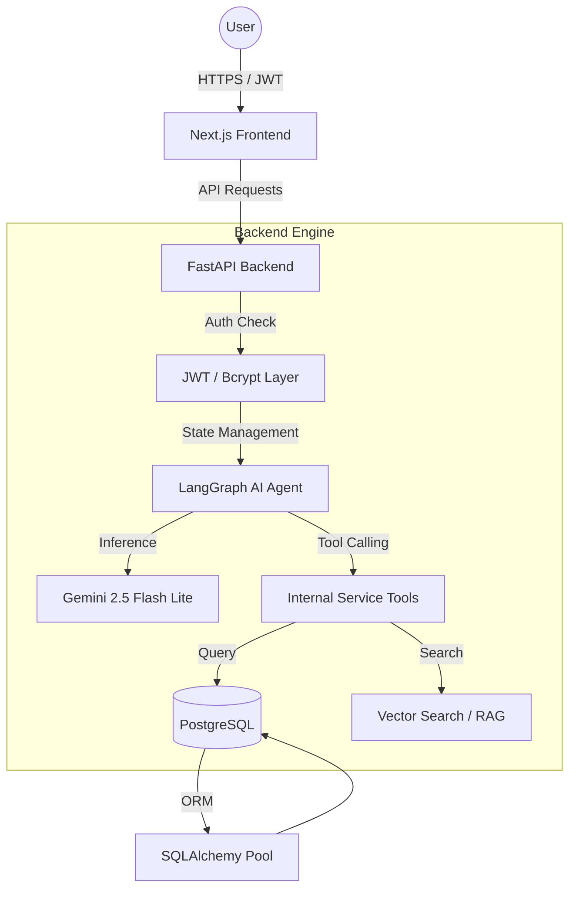

# 🏗️ System Architecture: AI Customer Support Copilot

This document provides a deep dive into the technical design, data flow, and security layers of the AI Customer Support Copilot ecosystem.

## 📡 System Overview

The application follows a modern micro-service-ready architecture, separating the **Modern Next.js Frontend** from the **Agentic Backend**.

---

## 🛠️ Key Architectural Components

### 1. Agentic reasoning (LangGraph)
Unlike traditional chatbots, this system uses **LangGraph** to manage conversational state as a "State Machine."
- **Cycle**: The agent receives a message -> decides to use a tool or reply -> executes the tool -> reviews the result -> loops back until the task is finished.
- **Persistence**: We use `MemorySaver` to allow the agent to remember context within a session.

### 2. Security-First Middleware
Security is enforced at the **Entry Point** (FastAPI) and the **Execution Point** (Tools):
- **JWT Middleware**: Every request to protected endpoints (`/ask`, `/admin/*`) must provide a valid Bearer Token.
- **Resource Guarding**: Tools like `tool_get_order_status` do not just take an `order_id`; they also receive the authenticated `user_id` from the JWT to ensure the user actually owns that order.

### 3. Data Management & Scaling
- **SQLAlchemy Pooling**: To handle multiple concurrent users, we use `QueuePool` with a `pool_size` of 10 and `max_overflow` of 20, preventing database connection exhaustion.
- **Alembic Migrations**: The database schema is versioned. New columns (like `tokens_used`) are added via migration scripts, ensuring zero-downtime updates.

### 4. RAG (Retrieval Augmented Generation)
- **Vector Store**: Knowledge base articles are embedded using `Sentence-Transformers` and stored in a `FAISS` vector index.
- **Search**: When a user asks a general question, the agent triggers `search_knowledge_base`, providing the AI with relevant facts before it generates an answer.

---

## 🔄 Data Flow: A Typical Request

1.  **Request**: User sends a question from the Next.js UI.
2.  **Auth**: FastAPI validates the JWT token in the header.
3.  **Agent Start**: LangGraph initializes the state with the user's message and history.
4.  **Inference**: Gemini analyzes the intent.
5.  **Action**: If the user asks "Where is my order?", Gemini triggers `tool_get_order_status`.
6.  **Verification**: The tool checks the DB and ensures the order belongs to the requester.
7.  **Final Response**: The agent synthesizes the tool's data into a friendly response.
8.  **Logging**: Token usage and the chat history are saved to PostgreSQL.
9.  **Stream**: The final answer is streamed back to the UI token-by-token for a smooth experience.

---

## 🛡️ Reliability Layers
- **Rate Limiting**: Applied per-IP to prevent API abuse.
- **Error Boundaries**: React boundaries prevent the UI from crashing if the backend is unreachable.
- **Graceful Fallback**: If the AI model fails, the system yields an "ERROR_FALLBACK" signal, triggering a manual support UI.
